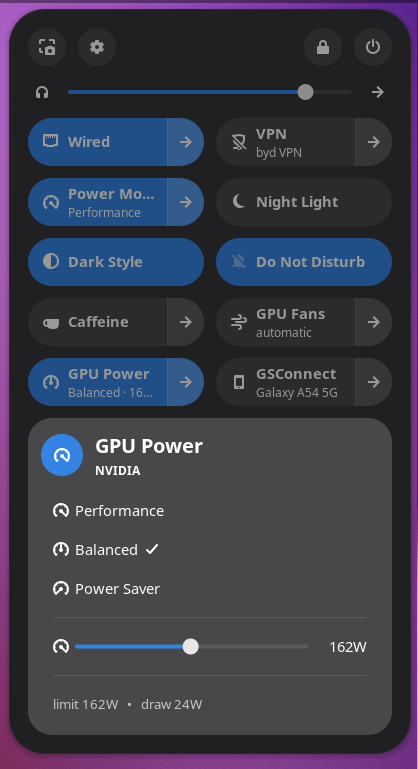

# gnome-gpu-power-mode

GPU power-mode control for NVIDIA cards on Linux, driven from the GNOME
Quick Settings menu. Pick **Power Saver**, **Balanced** or **Performance**,
or set an exact wattage with the slider. The range is read from the card at
runtime, so it fits any NVIDIA GPU, and it never pushes past the card's
rated power.

Tested on: Manjaro, GNOME Shell 50.4, Wayland, NVIDIA driver 610.57.04,
RTX 3060 Ti (100W min, 225W rated).



## What it does

The daemon controls the GPU power management limit through NVML:

- **Power Saver** = the card's minimum limit (100W on a 3060 Ti).
- **Balanced** = midpoint between min and rated.
- **Performance** = the card's rated default limit (225W on a 3060 Ti).
- **Slider** = any watts between min and rated.

Lowering the power limit reduces the transient current spikes that some
GPUs pull under load, which can help on a marginal or ageing power supply.
It also lowers heat and fan noise, at some cost in peak frame rate.

## Why a daemon

A GNOME Shell extension runs unprivileged and cannot change the power
limit. On Wayland the working path is NVML, which needs root. So the
project has two parts:

- `gpupowerd` — a small Python daemon (root, systemd) that uses NVML and
  exposes `org.bruno.GpuPowerMode` on the system D-Bus. It persists your
  choice to `/var/lib/gpu-power-mode` and re-applies it on boot.
- the GNOME extension — a Quick Settings toggle that calls the daemon.

## Components

```
daemon/
  controller.py                 mode <-> watts mapping (pure, unit-tested)
  nvml_backend.py               NVML wrapper (real power access)
  gpupowerd.py                  system D-Bus service + persistence
  org.bruno.GpuPowerMode.conf   D-Bus system policy
  gpupowerd.service             systemd unit
extension/
  extension.js                  Quick Settings toggle (GNOME 45+ ESM)
  metadata.json
  stylesheet.css
scripts/
  install.sh  uninstall.sh  spike_nvml.py   (spike is read-only)
tests/
  test_controller.py            run: /usr/bin/python3 -m unittest -v
```

## Install

```
./scripts/install.sh
```

Installs the daemon and system files (via sudo), starts the service, and
copies the extension. On Wayland, log out and back in, then:

```
gnome-extensions enable gpu-power-mode@bruno
```

## Uninstall

```
./scripts/uninstall.sh
```

## Requirements

`python-nvidia-ml-py`, `python-dbus`, `python-gobject` (installer pulls any
that are missing). NVIDIA driver with NVML power-management support.

## Disclaimer

This software changes a physical hardware setting (the GPU power limit). It
is provided WITHOUT ANY WARRANTY of any kind, to the extent permitted by
law. The authors and contributors are not liable for any damage, data loss,
instability, hardware failure or any other harm to your GPU, computer or
other property, whether caused by the software, a bug, a
misconfiguration, or by the user's own choices. Use at your own risk.

Note: lowering the power limit can reduce load-related shutdowns on a weak
PSU, but it does not repair a failing power supply. If your system shuts
off at idle or low load, suspect the PSU or cabling, not GPU power.

## License

GNU General Public License v3.0 or later (`GPL-3.0-or-later`). See
[LICENSE](LICENSE). You may use, study, modify and redistribute this
software under the terms of the GPL, keeping the copyright notice and
license, and passing the same freedoms to anyone you distribute it to.

## Author

Created by [brunos3d](https://github.com/brunos3d). Credit to the original
author is appreciated when reusing or modifying the code.
